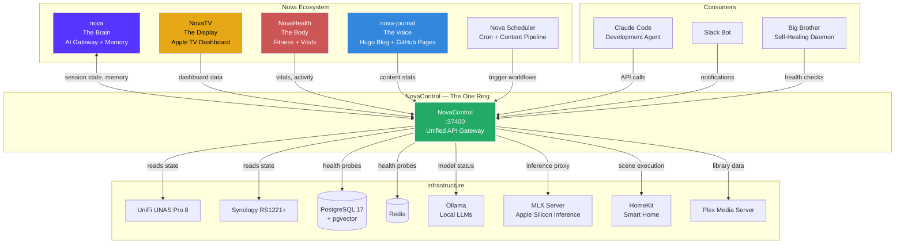
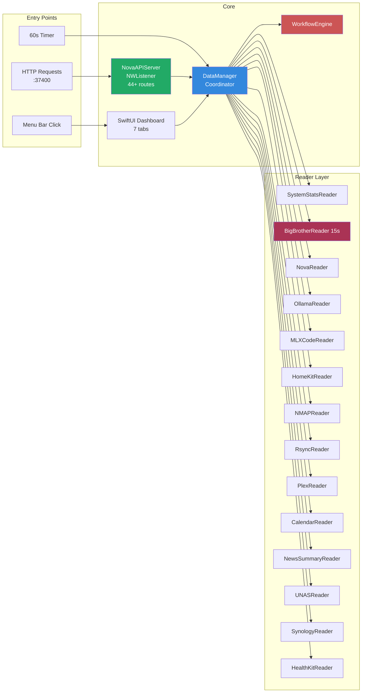
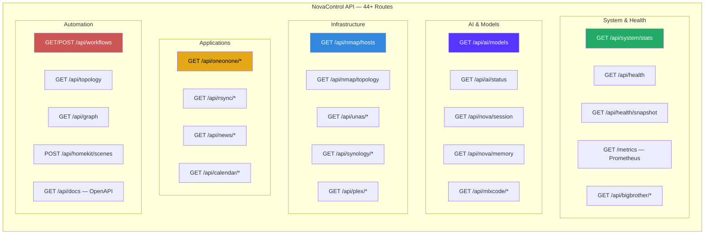

# NovaControl

**The unified API gateway for your local AI infrastructure.**

---

## The Problem

You have a dozen local services. An AI assistant. Network storage. HomeKit devices. Monitoring scripts. Media servers. Each one speaks its own protocol, lives on its own port, and requires its own process to be running.

Your AI asks "what's happening on my network?" and the answer requires hitting five different endpoints, parsing three file formats, and hoping every service is still alive.

This doesn't scale. It breaks at 3am. It's unmanageable.

## The Solution

NovaControl is a macOS menu bar application that consolidates everything into a single REST API on port 37400. It reads data files directly from disk, probes live services, monitors hardware health, and exposes it all through 44+ documented routes with ETag caching and OpenAPI specs.

The source applications don't need to be running. NovaControl reads their persisted state and makes it available on demand.

One port. One process. Every answer.

---

## What It Does

### Unified API Gateway (port 37400)

Every Nova component — the brain, the scheduler, the display, the health system — talks to NovaControl. It's the single source of truth for the entire ecosystem.

- **44+ REST API routes** with consistent JSON responses
- **ETag caching** — clients get 304s when nothing changed
- **OpenAPI documentation** — self-describing at `/api/docs`
- **Prometheus-compatible** `/metrics` endpoint for Grafana dashboards

### 14 Data Readers

NovaControl polls local services on a 60-second cycle (Big Brother at 15s) and caches results in memory. When a consumer asks for data, it's already there.

| Reader | Source | What It Provides |
|--------|--------|-----------------|
| SystemStats | Mach/IOKit kernel APIs | CPU, RAM, disk, uptime, thermals |
| BigBrother | Diagnostics daemon :37461 | 30+ service health statuses |
| Nova | Gateway v2 :18792 | Session state, model routing |
| Ollama | Local LLM server :11434 | Loaded models, VRAM usage |
| MLXCode | MLX inference :37422 | Active model, generation stats |
| HomeKit | Shortcuts CLI proxy | Scenes, device states, execution |
| NMAP | NMAPScanner container | Network topology, host discovery |
| Rsync | RsyncGUI app support | Backup job history, sync status |
| Plex | Synology Plex :32400 | Libraries, now playing, sessions |
| Calendar | ICS/CalDAV feeds | Upcoming events, scheduling |
| NewsSummary | App support JSON | Processed news items |
| UNAS | UniFi UNAS Pro 8 state | Storage pools, drive health, RAID |
| Synology | RS1221+ state | CPU, RAM, network, disk I/O |
| HealthKit | iOS health export | Step count, activity, vitals |

### 7-Tab SwiftUI Dashboard

Click the menu bar icon and get a full operational picture:

1. **System Health** — CPU, memory, disk, thermals, uptime
2. **Services** — All monitored services with live status indicators
3. **Network** — Topology map, connected hosts, port scan results
4. **Workflows** — Automation engine status, recent triggers
5. **AI** — Ollama models, VRAM allocation, generation activity
6. **NAS** — UNAS Pro 8 and Synology RS1221+ health panels
7. **Calendar** — Upcoming events from all synced calendars

### Workflow Automation Engine

NovaControl doesn't just read data — it acts on it:

- **Slack integration** — Post alerts, summaries, scheduled messages
- **Jira integration** — Create issues from detected problems
- **Email triggers** — Send notifications on threshold breaches
- **Webhooks** — Generic HTTP callbacks for any automation

### HomeKit Integration

The standalone HomeKitControl app was absorbed into NovaControl. Scene execution and device status are now API routes, callable by any Nova component without a separate process.

---

## Ecosystem Position

NovaControl is the connective tissue. Every component in the Nova ecosystem routes through it.



---

## Internal Architecture



---

## API Route Categories



---

## Why It Matters

### For the AI

Nova's brain doesn't need to know about 14 different data sources, file formats, ports, and authentication mechanisms. It knows one endpoint: `localhost:37400`. Ask any question about the infrastructure and the answer is one HTTP call away.

### For Reliability

Big Brother watches NovaControl. NovaControl watches everything else. If a service dies, NovaControl still serves its last-known state from cache. The 15-second Big Brother cycle means problems are detected in under 30 seconds.

### For Development

Adding a new data source means writing one Swift reader conforming to a protocol. Register it with DataManager, add a route, done. The framework handles caching, ETag generation, error responses, and dashboard integration.

### For Operations

One process to monitor. One port to firewall. One log to read. Prometheus scraping works out of the box. The menu bar dashboard gives instant visibility without opening a browser.

---

## Technical Details

| Property | Value |
|----------|-------|
| Platform | macOS 14.0+ (Sonoma) |
| Language | Swift 5.9 |
| UI Framework | SwiftUI |
| Network | Network.framework (NWListener) |
| Port | 37400 (localhost only) |
| Refresh Cycle | 60s standard / 15s Big Brother |
| API Format | JSON with ETag caching |
| Documentation | OpenAPI 3.0 at `/api/docs` |
| Metrics | Prometheus text format at `/metrics` |
| License | MIT |
| Version | 1.4.0 |

---

## The Ecosystem

NovaControl is one of five components that make up Nova:

| Component | Role | Analogy |
|-----------|------|---------|
| **nova** | AI gateway, memory, reasoning | The Brain |
| **NovaControl** | API gateway, monitoring, automation | The Nervous System |
| **NovaTV** | Apple TV dashboard display | The Eyes |
| **NovaHealth** | Fitness tracking, vitals | The Body |
| **nova-journal** | Auto-published blog, daily content | The Voice |

NovaControl is the nervous system — it doesn't think, but nothing works without it. Every signal passes through it. Every status check routes through it. Every automation triggers from it.

---

## One Port to Rule Them All

```
curl http://localhost:37400/api/health
```

That's it. One call tells you if your entire infrastructure is healthy. No service discovery. No port scanning. No guessing what's running.

NovaControl is always watching. NovaControl always knows.

---

*Built by Jordan Koch. MIT Licensed. Part of the Nova ecosystem.*
