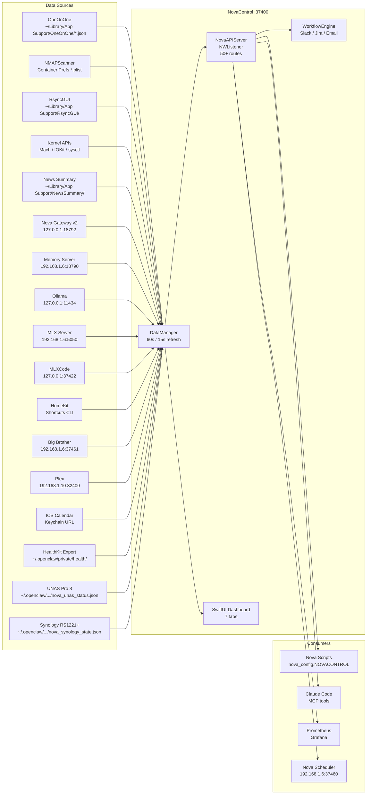

# NovaControl


A macOS menu bar application that consolidates 17 data sources into a single
unified HTTP API on `localhost:37400`. NovaControl reads each app's data files
directly, exposes everything via 50+ REST endpoints, and provides a 7-tab
SwiftUI dashboard with health monitoring, workflow automation, and
Prometheus-compatible metrics -- all without requiring the source applications
to be running.

---

## Architecture

NovaControl is a menu bar-only app (`LSUIElement = YES`) that launches an
`NWListener`-based HTTP server on `127.0.0.1:37400` at startup. It has zero
external Swift package dependencies -- the only framework beyond Foundation and
SwiftUI is `IOKit.framework` for disk I/O metrics.

```
NovaControlApp (@main)
  +-- AppDelegate
        |-- NovaAPIServer.shared.start()   (NWListener on 127.0.0.1:37400)
        |-- DataManager.shared.startRefreshing()
              |-- 60s timer: fetches all readers in parallel (async let)
              |-- 15s timer: BigBrother diagnostics refresh
              +-- Publishes @Published state to SwiftUI views
```

- **Binding**: `127.0.0.1:37400` (loopback only, never exposed to network)
- **Concurrency**: All readers are Swift `actor` types; DataManager uses
  structured concurrency to fetch all data streams in parallel
- **ETag caching**: SHA-256 hash over `JSONSerialization` output with
  `.sortedKeys` for stable hashing; clients send `If-None-Match` for `304`
- **Build system**: XcodeGen (`project.yml`) generates the `.xcodeproj`
- **Bundle ID**: `net.digitalnoise.NovaControl`

---

## Data Flow



---

## Dashboard Tabs

The floating SwiftUI window is accessible from the menu bar icon. Seven tabs:

| Tab | Content |
|-----|---------|
| **Action Items** | Open action items from OneOnOne with priority coloring, assignee lookup, due date warnings |
| **Devices** | Network devices from NMAPScanner with device type icons, manufacturer info, per-host threat counts |
| **System** | Live CPU, RAM, disk I/O, uptime badges plus top-20 process list |
| **News** | Unread breaking news from News Summary with source badges, category labels, click-to-open |
| **Nova** | AI service health grid, Nova identity stats, scheduler health, multi-agent status, Nova stack start/stop/restart controls with live progress |
| **Health** | Overall system banner (operational / degraded / outage), per-service traffic lights, local LLM inventory, system pressure gauges, UNAS + Synology NAS panels, attention-required section |
| **Diagnostics** | Big Brother daemon status, per-service health grid with restart counts, filterable heal-event feed, "Force Check" button |

---

## API Reference

All routes bind to `http://127.0.0.1:37400`. Full OpenAPI 3.0 spec at
`GET /api/docs`.

### Status and Infrastructure

| Method | Path | Description |
|--------|------|-------------|
| GET | `/api/status` | Service status overview with all reader states |
| GET | `/api/health` | Comprehensive healthcheck with per-source pass/fail |
| GET | `/api/health/status` | Retrieve stored manual health note |
| POST | `/api/health/status` | Store manual health note (`memoryPressure`, `notes`) |
| GET | `/api/health/snapshot` | HealthKit data (cached iOS export or native) |
| GET | `/api/topology` | Service communication graph with live probes |
| GET | `/api/graph` | Content relationship graph (Neo4j stub) |
| GET | `/api/docs` | OpenAPI 3.0.3 specification |
| GET | `/metrics` | Prometheus text-format gauges (16+ metrics) |

### OneOnOne

| Method | Path | Description |
|--------|------|-------------|
| GET | `/api/oneonone/meetings` | Meetings list (`?limit=N`) |
| GET | `/api/oneonone/meetings/{id}` | Single meeting by UUID |
| POST | `/api/oneonone/meetings/{id}/summary` | Generate AI summary for meeting |
| GET | `/api/oneonone/actionitems` | Action items (`?completed=true\|false`) |
| GET | `/api/oneonone/people` | People directory |
| GET | `/api/oneonone/goals` | Goals list |
| GET | `/api/oneonone/goals/insights` | Goal completion metrics with health correlation |

### NMAPScanner

| Method | Path | Description |
|--------|------|-------------|
| GET | `/api/nmap/devices` | All scanned network devices |
| GET | `/api/nmap/threats` | Security threat findings |
| POST | `/api/nmap/scan` | Trigger nmap scan (`{"ip":"..."}`) |

### RsyncGUI

| Method | Path | Description |
|--------|------|-------------|
| GET | `/api/rsync/jobs` | Sync job definitions |
| GET | `/api/rsync/history` | Execution history |
| POST | `/api/rsync/jobs/{id}/run` | Execute a specific rsync job |

### System Stats

| Method | Path | Description |
|--------|------|-------------|
| GET | `/api/system/stats` | CPU, RAM, disk I/O, uptime |
| GET | `/api/system/processes` | Top 20 processes by CPU |

### News Summary

| Method | Path | Description |
|--------|------|-------------|
| GET | `/api/news/breaking` | Breaking/unread news articles |
| GET | `/api/news/favorites` | Favourite articles |
| GET | `/api/news/articles/{category}` | Articles filtered by category |

### Nova AI Services

| Method | Path | Description |
|--------|------|-------------|
| GET | `/api/nova/status` | Nova Gateway v2 + memory server status |
| GET | `/api/nova/memory` | Vector memory stats from memory server |
| GET | `/api/nova/crons` | Scheduler task list (via `192.168.1.6:37460`) |
| GET | `/api/nova/agents` | Multi-agent status (chat, research, home) |
| GET | `/api/ai/status` | Parallel probe of 7 AI services |
| GET | `/api/ai/llms` | Combined LLM inventory (Ollama + MLX) |
| POST | `/api/ai/summarize` | Summarize text via Ollama (`{"content":"..."}`) |
| POST | `/api/ai/extract-actions` | Extract action items from notes (`{"notes":"..."}`) |
| GET | `/api/mlxcode/status` | MLXCode proxy status |
| GET | `/api/mlxcode/{path}` | MLXCode proxy passthrough |

### HomeKit

| Method | Path | Description |
|--------|------|-------------|
| GET | `/api/homekit/scenes` | List HomeKit scenes (`?refresh=true`) |
| POST | `/api/homekit/scenes/execute` | Execute a scene (`{"name":"..."}`) |
| GET | `/api/homekit/accessories` | List HomeKit accessories |
| POST | `/api/homekit/refresh` | Force refresh scene cache |

### Plex Media Server

| Method | Path | Description |
|--------|------|-------------|
| GET | `/api/plex/status` | Server version, active streams, library summary |
| GET | `/api/plex/playing` | Currently active playback sessions |
| GET | `/api/plex/ondeck` | In-progress items (`?limit=N`, default 10) |
| GET | `/api/plex/recent` | Recently added items (`?limit=N`, default 10) |
| GET | `/api/plex/library` | Per-library item counts |

### Calendar

| Method | Path | Description |
|--------|------|-------------|
| GET | `/api/calendar/today` | Today's and tomorrow's events |
| GET | `/api/calendar/upcoming` | Events within N minutes (`?minutes=30`) |
| GET | `/api/calendar/events` | Events in next N days (`?days=7`) |

### NAS Storage

| Method | Path | Description |
|--------|------|-------------|
| GET | `/api/unas/status` | UNAS Pro 8 device info, health, storage summary |
| GET | `/api/unas/storage` | Storage bytes, used %, free TB, warning flags |
| GET | `/api/unas/shares` | Shared drive list with per-share usage |
| GET | `/api/synology/status` | RS1221+ CPU, RAM, network, disk I/O, volume health |

### Big Brother Diagnostics (Proxy)

| Method | Path | Description |
|--------|------|-------------|
| * | `/api/bigbrother/*` | Proxied to Big Brother daemon at `127.0.0.1:37461` |

### Workflow Automation

| Method | Path | Description |
|--------|------|-------------|
| GET | `/api/workflows` | List workflow definitions |
| POST | `/api/workflows/{id}/run` | Execute a workflow with context |
| GET | `/api/workflows/runs` | Recent workflow run history |

---

## Data Sources

| Source | Reader | Data Path | Refresh |
|--------|--------|-----------|---------|
| OneOnOne | `OneOnOneReader` | `~/Library/Application Support/OneOnOne/*.json` | 60s |
| NMAPScanner | `NMAPReader` | `~/Library/Containers/com.digitalnoise.nmapscanner.macos/.../Preferences/*.plist` | 60s |
| RsyncGUI | `RsyncReader` | `~/Library/Application Support/RsyncGUI/` | 60s |
| System Stats | `SystemStatsReader` | Mach `host_statistics` / `vm_statistics64` / IOKit / sysctl | 60s |
| News Summary | `NewsSummaryReader` | `~/Library/Application Support/NewsSummary/*.json` | 60s |
| Nova Gateway v2 | `NovaReader` | HTTP `127.0.0.1:18792/health` | 60s |
| Nova Memory | `NovaReader` | HTTP `192.168.1.6:18790/health` + `/stats` | 60s |
| Ollama | `NovaReader` | HTTP `127.0.0.1:11434/api/tags` + `/api/ps` | 60s |
| MLX Server | `NovaReader` | HTTP `192.168.1.6:5050/v1/models` | 60s |
| MLXCode | `MLXCodeReader` | HTTP proxy `127.0.0.1:37422` | 60s |
| HomeKit | `HomeKitReader` | Shortcuts CLI (`/usr/bin/shortcuts run`) | 5-min cache |
| AI Summarization | `AIServiceReader` | Ollama `/api/generate` | on-demand |
| Big Brother | `BigBrotherReader` | HTTP `192.168.1.6:37461/bb/*` | 15s |
| Plex | `PlexReader` | HTTP `192.168.1.10:32400` (token from Keychain) | on-demand |
| Calendar | `CalendarReader` | ICS URL from Keychain, parsed locally | 15-min cache |
| HealthKit | `HealthKitReader` | `~/.openclaw/private/health/latest.json` | on-demand |
| UNAS Pro 8 | `UNASReader` | `~/.openclaw/workspace/state/nova_unas_status.json` | 60s |
| Synology RS1221+ | `SynologyReader` | `~/.openclaw/workspace/state/nova_synology_state.json` | 60s |

---

## Configuration

NovaControl works out of the box for local data sources (OneOnOne, NMAP,
Rsync, System, News). External services require Keychain entries.

### macOS Keychain Entries

| Service | Account | Value | Used By |
|---------|---------|-------|---------|
| `nova-plex-token` | `nova` | Plex authentication token | PlexReader |
| `nova-calendar-ics-url` | `nova` | Office 365 / CalDAV ICS feed URL | CalendarReader |

Store with:
```bash
security add-generic-password -s "nova-plex-token" -a "nova" -w "YOUR_PLEX_TOKEN"
security add-generic-password -s "nova-calendar-ics-url" -a "nova" -w "https://outlook.office365.com/owa/calendar/..."
```

### Slack Token (Workflow Engine)

The workflow engine loads the Slack bot token from
`~/.openclaw/openclaw.json` at runtime:
```json
{ "channels": { "slack": { "botToken": "xoxb-..." } } }
```

### Prometheus / Grafana

Scrape config target: `http://127.0.0.1:37400/metrics`. All gauges use the
`novacontrol_` prefix.

### Workflow Definitions

Stored at `~/Library/Application Support/NovaControl/Workflows/definitions.json`.
Three built-in workflows ship by default:

| Workflow | Trigger | Action |
|----------|---------|--------|
| New Action Item to Slack | `newActionItem(priority: "high")` | Post to `#nova-chat` |
| Completed Action Item to Jira | `actionItemCompleted` | Create Jira issue, notify Slack |
| Daily Open Actions Summary | `manual` | Send email digest |

---

## Integration Points

NovaControl is the single stable contract for all Nova automation. Scripts use
`nova_config.NOVACONTROL = "http://127.0.0.1:37400"` and never hardcode
individual service ports.

| Component | Port | Role |
|-----------|------|------|
| **NovaControl** | 37400 | Unified API gateway (this app) |
| Nova Gateway v2 | 18792 | Python asyncio chat/agent gateway |
| Nova Memory Server | 18790 | pgvector-backed memory (LAN: 192.168.1.6) |
| Nova Scheduler | 37460 | Cron task runner (LAN: 192.168.1.6) |
| Big Brother | 37461 | Self-healing diagnostics daemon (LAN: 192.168.1.6) |
| Ollama | 11434 | Local LLM inference |
| MLX Server | 5050 | Apple Silicon ML inference (LAN: 192.168.1.6) |
| MLXCode | 37422 | MLXCode HTTP API |
| Plex | 32400 | Media server (Synology NAS: 192.168.1.10) |
| PostgreSQL | 5432 | nova_ops / nova_memories databases |
| Redis | 6379 | Session cache |
| OpenWebUI | 3000 | Chat frontend |
| SwarmUI | 7801 | Image generation UI |

---

## Build and Run

### Requirements

- macOS 14.0 (Sonoma) or later
- Xcode 15+ and [XcodeGen](https://github.com/yonaskolb/XcodeGen) (`brew install xcodegen`)
- Optional: [nmap](https://nmap.org/) for live scan support (`brew install nmap`)

### Build from Source

```bash
git clone git@github.com:kochj23/NovaControl.git
cd NovaControl
xcodegen generate
xcodebuild -scheme NovaControl -configuration Release build -allowProvisioningUpdates
```

Or open `NovaControl.xcodeproj` in Xcode and press Cmd+B.

### Run Tests

```bash
xcodegen generate
xcodebuild test -scheme NovaControl -destination 'platform=macOS'
```

45 unit tests across three suites: `ServiceModelsTests` (26), `WorkflowEngineTests` (10), `SecurityTests` (9).

---

## Project Structure

```
NovaControl/
+-- NovaControlApp.swift              App entry, NSStatusItem menu bar setup
+-- Models/
|   +-- ServiceModels.swift           Codable models for all service domains
+-- Services/
|   +-- DataManager.swift             @MainActor ObservableObject, 60s+15s timers
|   +-- NovaAPIServer.swift           NWListener HTTP server, 50+ routes, ETag, OpenAPI
|   +-- WorkflowEngine.swift          State machine: triggers, steps, Slack/Jira/email
|   +-- Readers/
|       +-- OneOnOneReader.swift       Meetings, action items, people, goals from JSON
|       +-- NMAPReader.swift           Devices/threats from sandboxed plist, runs nmap
|       +-- RsyncReader.swift          Sync jobs and history, can execute rsync
|       +-- SystemStatsReader.swift    Mach host_statistics, vm_statistics64, IOKit, ps
|       +-- NewsSummaryReader.swift    Articles from JSON, filters by category/favorites
|       +-- NovaReader.swift           Gateway v2, memory, Ollama, MLX, agents, scheduler
|       +-- MLXCodeReader.swift        Proxies MLXCode HTTP API on port 37422
|       +-- HomeKitReader.swift        Shortcuts CLI for scenes and accessories
|       +-- AIServiceReader.swift      Ollama-powered summarization and action extraction
|       +-- BigBrotherReader.swift     Diagnostics daemon status, events, services (15s)
|       +-- PlexReader.swift           Plex: status, playing, on deck, recent, library
|       +-- CalendarReader.swift       ICS/CalDAV feed parser with 15-min cache
|       +-- HealthKitReader.swift      HealthKit snapshot; iOS export fallback
|       +-- UNASReader.swift           UniFi UNAS Pro 8 storage from JSON state file
|       +-- SynologyReader.swift       RS1221+ CPU/RAM/network/disk from JSON state file
+-- Views/
|   +-- StatusWindowView.swift         7-tab SwiftUI dashboard
+-- Resources/
    +-- NovaControl.entitlements       No sandbox, network server+client, HealthKit
```

---

## Security

- **Loopback only**: HTTP server binds exclusively to `127.0.0.1`
- **Read-only**: All readers only read app data files; NovaControl never writes
  to another application's data store
- **Keychain credentials**: Plex token and calendar URL stored in macOS
  Keychain via Security framework; Slack token loaded from openclaw config
- **No outbound network** (except workflows): Core data collection is local;
  outbound HTTP only occurs in workflow steps (Slack, Jira, webhook)
- **No sandbox**: Required for reading other apps' containers and Application
  Support directories
- **Entitlements**: app-sandbox disabled, network.server + network.client
  enabled, HealthKit access declared

For vulnerability reporting, see [SECURITY.md](SECURITY.md).

---

## Changelog

### v1.4.0 (June 2026)

- **UNASReader** -- UNAS Pro 8 storage monitoring (`/api/unas/status`,
  `/api/unas/storage`, `/api/unas/shares`)
- **SynologyReader** -- RS1221+ resource monitoring: CPU, RAM, network
  throughput, disk I/O (`/api/synology/status`)
- Both NAS devices surfaced in Health tab with live gauges
- Nova Gateway v2 port migration (18789 to 18792) and LAN IP updates

### v1.3.0 (May 2026)

- **PlexReader** -- five endpoints for Plex Media Server (Keychain token)
- **CalendarReader** -- three calendar endpoints from ICS URL (Keychain)
- **HealthKitReader** -- `/api/health/snapshot` with iOS export fallback
- Route count increased from 28 to 44+
- All Nova scripts migrated from OneOnOne port 37421 to NovaControl 37400

### v1.2.0 (April 2026)

- HomeKit scene listing, execution, and accessories via Shortcuts CLI
- AI summarization and action extraction via Ollama
- Big Brother Diagnostics tab with 15s refresh
- Multi-agent status display and `/api/nova/agents` endpoint
- Nova stack start/stop/restart controls with live progress

### v1.1.0 (April 2026)

- Health Dashboard tab with traffic lights, pressure gauges, LLM inventory
- Workflow Automation Engine (Slack, Jira, email, webhook steps)
- OpenAPI 3.0 documentation at `/api/docs`
- Prometheus metrics at `/metrics` (16 gauges)
- Content graph and topology mapping endpoints
- ETag caching on all GET responses
- Goal insights with health correlation

### v1.0.0 (March 2026)

- Initial release: unified API gateway on port 37400
- Menu bar app with 5-tab SwiftUI dashboard
- OneOnOne, NMAPScanner, RsyncGUI, TopGUI, and News Summary readers
- 60-second auto-refresh cycle
- Nova gateway and memory server probes

---

## License

[](LICENSE)

MIT License -- see [LICENSE](LICENSE) for the full text.

Copyright (c) 2026 Jordan Koch
